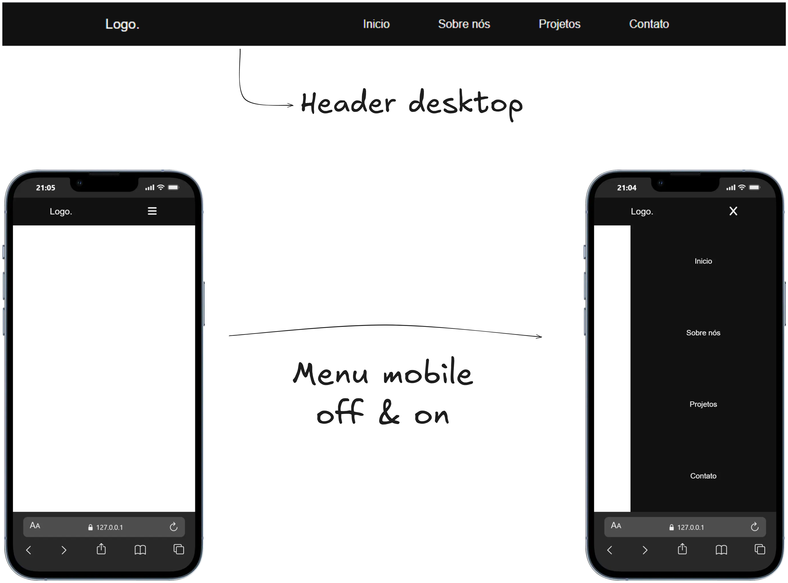

# Responsive Header

Header responsivo desenvolvido utilizando **HTML, CSS e JavaScript puro**, com foco em estrutura semântica, organização de código e adaptação para diferentes tamanhos de tela.

## 📌 Objetivo

Criar um header moderno e funcional contendo:

- Logo
- Menu de navegação
- Botão hambúrguer para mobile
- Animação simples de abertura e fechamento
- Layout responsivo

## Tecnologias Utilizadas

## Screenshots
